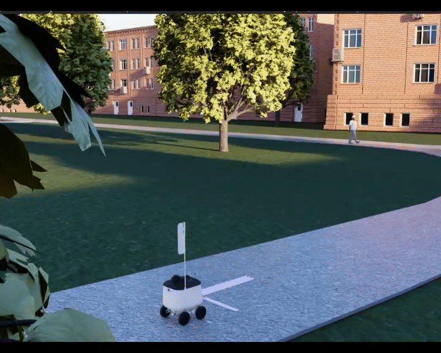
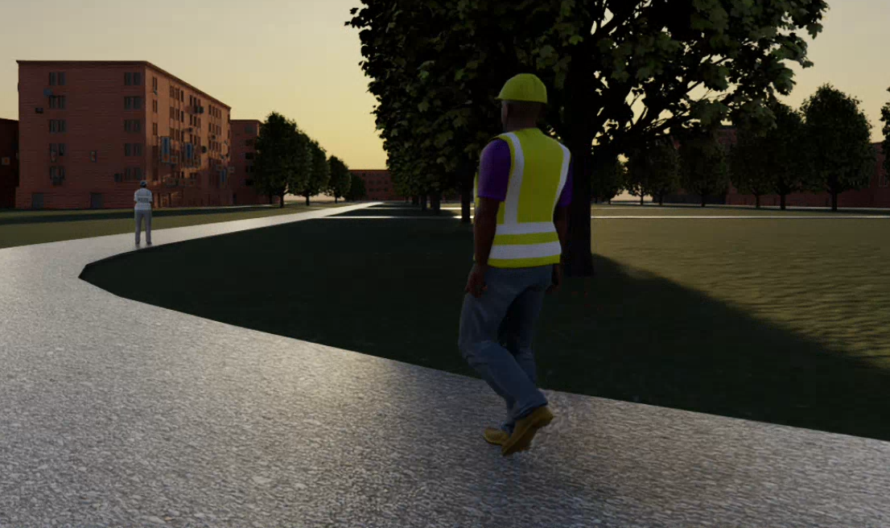
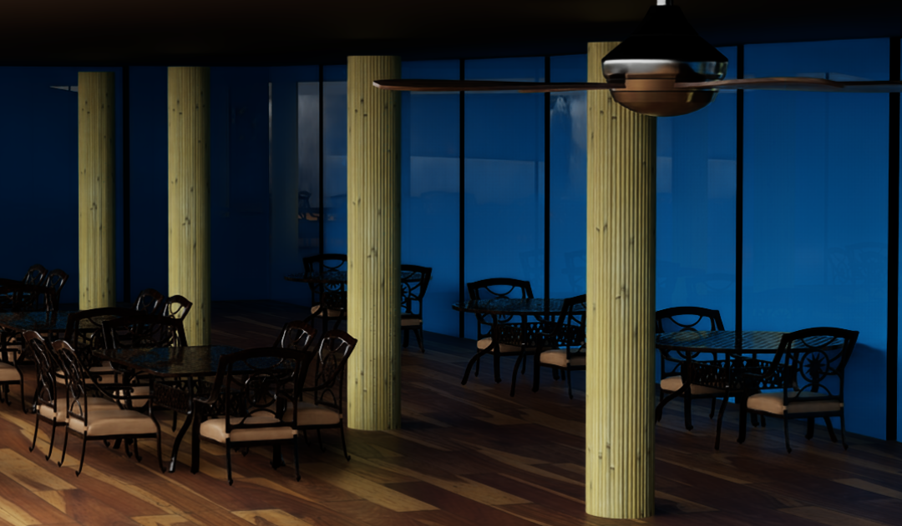

# Blog

In early July 2025, I had the opportunity to join [robot.com](http://robot.com) as an Autonomy Intern to modernize our simulation stack, which at the time was based on Gazebo Classic. During my internship, I primarily worked on developing a simulator built on top of Isaac Sim, a modern, capable robotics simulation platform. When I was exploring the simulator’s landscape at first, it caught my attention for how well the renders looked like, there are only a few simulators  out there than can compete with Isaac Sim rendering capabilities, most of them are game-engine based ones which is one of the interesting trends in robotics simulations. 

*R kiwi moving on IsaacSim.*

Learning Isaac Sim was a whole challenge for me; I had the opportunity to work previously with simulations in Gazebo, so I was familiarized with certain things. Isaac Sim is disruptive because it adopts new technologies compared to the traditional simulators but many things remain the same at the end.

During my journey, I found Isaac Sim sometimes intuitive, sometimes not, mostly because there are missing docs for essentials parts of the simulator which makes the learning curve steeper but there is a great community behind it which somehow compensates this, sometimes where I felt stuck I asked on the forum and Discord community and it is very likely that someone has already faced your issue, that’s something that we should value too, the community. Despite the lack of documentation, Isaac Sim offers a great developer experience through its whole Omniverse ecosystem, which was something that I struggled to understand at first, but once you get it, you get it. Omniverse is a platform for building applications, and Isaac Sim is built on top of it. The fact that you can use Python to extend the simulator capabilities, the existing no-code approaches and templates for reducing repetitive work, helps you getting a pleasant experience while learning this. I have been playing around with Isaac Sim since 4.5.0, and I have noticed a lot of interesting changes in the performance and stability of the simulator, which highlights the effort and work that developers are putting into it.

*Agents moving on Isaac Sim*

One of my first tasks for the development of the simulator was exporting our R Kiwi CAD model to URDF and then converting it to the Isaac Sim USD format. The conversion from CAD to URDF has its tricks and may take a bit of time depending on your CAD skills, once you got that, which is actually the most time consuming step of the workflow, then importing this to Isaac Sim is straightforward but still may require tuning eventually to ensure that your robot is behaving as you would expect. For the modeling work, I used some free assets from the Omniverse ecosystem, they have a huge and high quality collection of them for a lot of uses, from vegetation to pallets for industrial applications. I also had to model environments and a few assets, for the ones that I modeled I chose to do it in Blender, and it was a cool experience. Blender has an unbelievable amount of features that can make you feel lost the first time, but that is something that you overcome after using the program regularly.

.png)

*A section of an university campus recreated on Isaac Sim.*

*Dynamic actors walking on Isaac Sim.*

I*nterior view of a restaurant in our recreated world on Isaac Sim.*

Once I got the URDF, I moved to work with Isaac Sim, which was the part that I liked the most, it was actually very fun to explore and build solutions on top of this platform, even though it is a relatively young simulator, there are a few good series of tutorials regarding how to do common tasks for robotics which are a great help as a beginner. I found Isaac Sim fun most of the time, except when it crashed or became laggy, on recent versions it does not crash that often but getting enough hardware resources to run simulations at a decent frame rate it is tricky, I ran it on a wide variety of GPUs such as RTX 4090, 5090, RTX 5000 ADA, with +64 GB RAM and CPUs like AMD Ryzen Threadripper PRO, AMD Ryzen 9 5900X, all of them as virtual machines hosted on [vast.ai](http://vast.ai) which is an affordable platform for running gpu heavy workloads, in order to run the simulations on that platform, I had to create a custom docker image extending the vast.ai templates, they provide base images with almost everything you need for doing this kind of work, you get a setup with a GUI, SSH, remote desktop access protocols like noVNC and WebRTC and it is a plug and play approach because you don’t have to set it up from scratch. I also tried running it on my local computer which has an RTX 2070S, 32 GB RAM and an Intel(R) Core(TM) i7-10750H CPU @ 2.60GHz, to make it work, I had to adjust some settings like the resolution, physics timestep and graphics presets, and it ran acceptable, worth pointing out that performance depends on a wide set of factors, whether you are simulating a large outdoors scene or a simple grid, a full sensor suite with cameras, LiDARs, an IMU or just a single camera, all those things impact performance significantly.

(2).png)

*Our R kiwi on Isaac Sim.*

*Isaac Sim camera’s view on a warehouse.*

Isaac Sim remains an impressive platform that offers a valuable array of features for various robotics applications. While it has some performance and optimization issues, it is still a capable and promising tool worth exploring. However, I encourage you to keep in mind the limitations I mentioned earlier, as they could potentially bottleneck your applications.

[Timeline 100.mov](Blog/Timeline_100.mov)

Taking the above into account, Isaac Sim can be evaluated through a balanced view of its strengths and limitations.

Advantages:

- Photorealistic rendering
- Accurate physics
- Strong integration with ROS2
- Rich tooling for the whole Omniverse ecosystem
- Backed by NVIDIA

Disadvantages:

- High hardware requirements
- Performance and optimization limitations
- Limited scalability for large-scale simulations
- Incomplete documentation in some areas
- Struggles to consistently reach a real-time factor of 1 without sacrificing rendering and physics accuracy

Apart from the work that I have mentioned, I would have loved to work on extending the simulator’s capabilities to replicate corner cases for our stack and integrating it into a complete CI/CD pipeline to strengthen our QA procedures, also on simulating other platforms like the R dog, R noid and running a Hardware-In-The-Loop (HIL) simulation but I did not have the time to do all this, however, it’s something that can be done on top of this platform but it is important to keep in mind the previously mentioned limitations of the simulator.

I feel incredibly fortunate to have the opportunity to work at this company. Throughout my journey here, I have learned a great deal, not only about robotics but also about problem-solving, software engineering, and collaborating effectively within a fantastic team. I genuinely appreciate that the people here are not only skilled in their roles but also genuinely care about helping one another. Whether it’s my mentors or the entire team, everyone is eager to lend a hand, which has made this experience much more enjoyable. I am really grateful for the opportunity and for all the skills I have gained while working at this company under excellent leadership and guidance from the Autonomy department. 

It’s been a privilege to be part of this team, thank you [robot.com](http://robot.com) and my mentors for the opportunity, the challenges, their continuous support, their willingness to help and the trust they placed in me throughout this journey.
